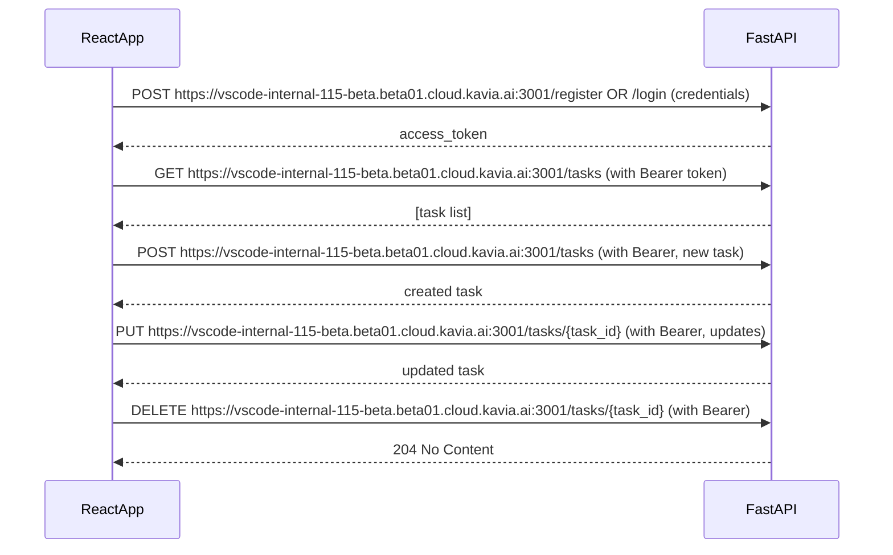

# ToDo List App Integration Guide
## Connecting the React Frontend to the FastAPI Backend

This document explains how to integrate the React-based frontend with the FastAPI backend for the ToDo list application. It covers API endpoints, authentication flows, request and response schemas, and practical integration tips for frontend developers.

---

## 1. Overview & API Base URL

**API Base URL:**  
For all requests from the React frontend, use the following deployed backend URL:

```
https://vscode-internal-115-beta.beta01.cloud.kavia.ai:3001
```

All endpoint references and code samples in this document now utilize this base URL.
For local development, you may substitute your local server's address as needed.

---

## 2. Authentication Flow

Authentication uses JWT (JSON Web Tokens) with **Bearer** tokens.

- Users must **register** or **log in** using their username and password.
- Upon successful login/registration, an **access token** is returned.
- This token must be attached to subsequent requests via the HTTP header:
  ```
  Authorization: Bearer <access_token>
  ```

### Register

- **Endpoint:** `POST https://vscode-internal-115-beta.beta01.cloud.kavia.ai:3001/register`
- **Request payload:**
  ```json
  {
    "username": "user1",
    "password": "yourpassword"
  }
  ```
- **Response:**
  ```json
  {
    "access_token": "<jwt_token>",
    "token_type": "bearer"
  }
  ```

### Login

- **Endpoint:** `POST https://vscode-internal-115-beta.beta01.cloud.kavia.ai:3001/login`
- **Content-Type:** `application/x-www-form-urlencoded`
- **Request fields:** (`username`, `password`)
  ```bash
  username=user1&password=yourpassword
  ```
- **Response:**
  ```json
  {
    "access_token": "<jwt_token>",
    "token_type": "bearer"
  }
  ```

> **Note:** Both `/register` and `/login` return the access token needed for subsequent API calls.

---

## 3. Tasks API

The following endpoints manage tasks for the **authenticated user**. Each request, except `/`, `/login`, and `/register`, **must include** the Bearer token in the `Authorization` header.

### 3.1. Create Task

- **Endpoint:** `POST https://vscode-internal-115-beta.beta01.cloud.kavia.ai:3001/tasks`
- **Headers:** `Authorization: Bearer <access_token>`
- **Request body:**
  ```json
  {
    "title": "Buy groceries",
    "description": "Milk, eggs, bread",
    "due_date": "2024-06-22T18:30:00",     // optional, ISO string
    "completed": false                      // optional, defaults to false
  }
  ```
- **Response:**
  ```json
  {
    "id": "string-uuid",
    "title": "Buy groceries",
    "description": "Milk, eggs, bread",
    "due_date": "2024-06-22T18:30:00",
    "completed": false
  }
  ```

### 3.2. List / Filter Tasks

- **Endpoint:** `GET https://vscode-internal-115-beta.beta01.cloud.kavia.ai:3001/tasks`
- **Headers:** `Authorization: Bearer <access_token>`
- **Query parameters** (all optional):
  - `completed`: `true` or `false` – return only completed/incomplete tasks.
  - `search`: string – filter by title or description.
- **Example Request:**  
  `https://vscode-internal-115-beta.beta01.cloud.kavia.ai:3001/tasks?completed=false&search=buy`
- **Response:**
  ```json
  [
    {
      "id": "string-uuid",
      "title": "Buy groceries",
      "description": "Milk, eggs, bread",
      "due_date": "2024-06-22T18:30:00",
      "completed": false
    },
    ...
  ]
  ```

### 3.3. Get Task By ID

- **Endpoint:** `GET https://vscode-internal-115-beta.beta01.cloud.kavia.ai:3001/tasks/{task_id}`
- **Headers:** `Authorization: Bearer <access_token>`
- **Response:**
  ```json
  {
    "id": "string-uuid",
    "title": "Buy groceries",
    "description": "Milk, eggs, bread",
    "due_date": "2024-06-22T18:30:00",
    "completed": false
  }
  ```

### 3.4. Update a Task

- **Endpoint:** `PUT https://vscode-internal-115-beta.beta01.cloud.kavia.ai:3001/tasks/{task_id}`
- **Headers:** `Authorization: Bearer <access_token>`
- **Request body:** (any combination of updatable fields)
  ```json
  {
    "title": "Buy groceries and fruits",
    "description": "Milk, eggs, apples, oranges",
    "due_date": "2024-06-23T19:00:00",
    "completed": true
  }
  ```
- **Response:** same as “Get Task By ID” (the complete updated task object)

### 3.5. Delete a Task

- **Endpoint:** `DELETE https://vscode-internal-115-beta.beta01.cloud.kavia.ai:3001/tasks/{task_id}`
- **Headers:** `Authorization: Bearer <access_token>`
- **Response:** HTTP 204 No Content (no response body on success)

### 3.6. Mark Task as Complete

- **Endpoint:** `POST https://vscode-internal-115-beta.beta01.cloud.kavia.ai:3001/tasks/{task_id}/complete`
- **Headers:** `Authorization: Bearer <access_token>`
- **Response:** Updated task object (see above).

---

## 4. Health Check Endpoint

- **Endpoint:** `GET https://vscode-internal-115-beta.beta01.cloud.kavia.ai:3001/`
- **Purpose:** Returns `{"message": "Healthy"}` to test server status.

---

## 5. Example: End-to-End Usage

### Registration/Login → List/Create Tasks (Frontend Example in JavaScript):

```js
// Register or log in
const login = async () => {
  const res = await fetch('https://vscode-internal-115-beta.beta01.cloud.kavia.ai:3001/login', {
    method: 'POST',
    headers: {'Content-Type': 'application/x-www-form-urlencoded'},
    body: new URLSearchParams({
      username: 'user1',
      password: 'pass123'
    }),
  });
  const data = await res.json();
  return data.access_token;
};

const fetchTasks = async (token) => {
  const res = await fetch('https://vscode-internal-115-beta.beta01.cloud.kavia.ai:3001/tasks', {
    headers: {Authorization: 'Bearer ' + token}
  });
  const tasks = await res.json();
  return tasks;
};
```

---

## 6. Error Handling

- On authentication failures, the backend returns HTTP 401.
- On resource not found, HTTP 404.
- Duplicate username during registration: HTTP 400.
- Malformed payload: HTTP 422.

Frontend code should handle these based on `.status` and error `.json()` body.

---

## 7. Notes and Considerations

- The current backend uses in-memory storage – **data will not persist across restarts**.
- Bearer JWT tokens should be securely stored in the frontend (e.g., context or localStorage with XSS protection).
- The backend is CORS-enabled (allowing access from all origins for development; restrict in production).
- All dates are in ISO8601 UTC string format.

---

## 8. API Endpoints Reference Table

| Method | Endpoint                    | Auth Required | Description                         |
|--------|-----------------------------|--------------|-------------------------------------|
| POST   | https://vscode-internal-115-beta.beta01.cloud.kavia.ai:3001/register                 | No           | Register new user                   |
| POST   | https://vscode-internal-115-beta.beta01.cloud.kavia.ai:3001/login                    | No           | User login                          |
| GET    | https://vscode-internal-115-beta.beta01.cloud.kavia.ai:3001/                         | No           | Health check                        |
| POST   | https://vscode-internal-115-beta.beta01.cloud.kavia.ai:3001/tasks                    | Yes          | Create task                         |
| GET    | https://vscode-internal-115-beta.beta01.cloud.kavia.ai:3001/tasks                    | Yes          | List/filter tasks                   |
| GET    | https://vscode-internal-115-beta.beta01.cloud.kavia.ai:3001/tasks/{task_id}          | Yes          | Get task detail                     |
| PUT    | https://vscode-internal-115-beta.beta01.cloud.kavia.ai:3001/tasks/{task_id}          | Yes          | Update task                         |
| DELETE | https://vscode-internal-115-beta.beta01.cloud.kavia.ai:3001/tasks/{task_id}          | Yes          | Delete task                         |
| POST   | https://vscode-internal-115-beta.beta01.cloud.kavia.ai:3001/tasks/{task_id}/complete | Yes          | Mark as complete                    |

---

## 9. Sample Sequence Diagram



---

## 10. Further Reading

- [FastAPI documentation](https://fastapi.tiangolo.com/)
- [MDN: Fetch API](https://developer.mozilla.org/en-US/docs/Web/API/Fetch_API)
- [JWT.io Introduction](https://jwt.io/introduction/)

---

### Questions/Support

Contact backend developers or consult the OpenAPI (Swagger) documentation usually available at `/docs` endpoint of your backend server.
